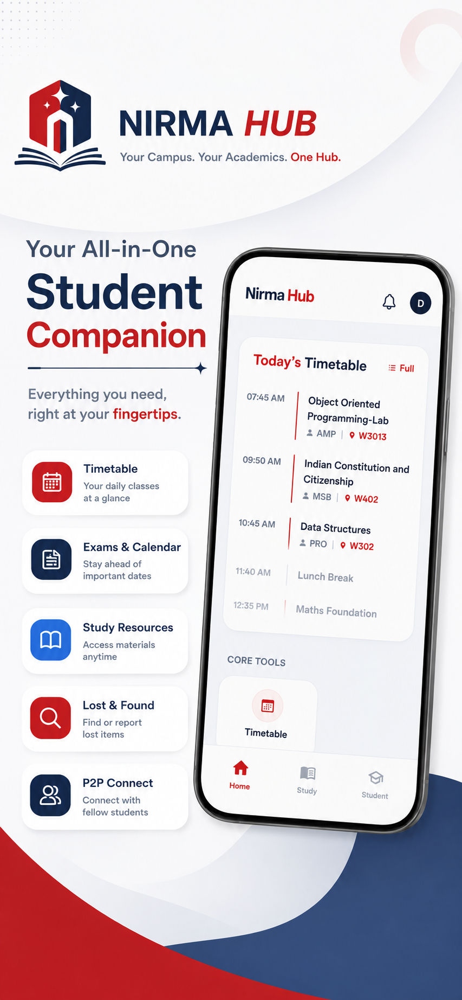
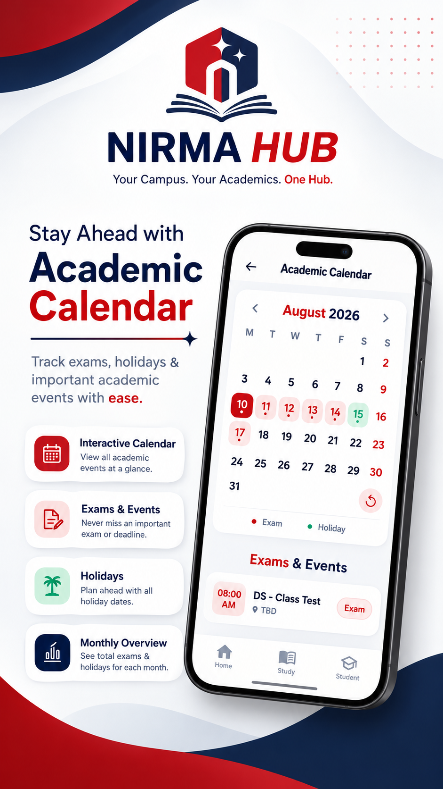
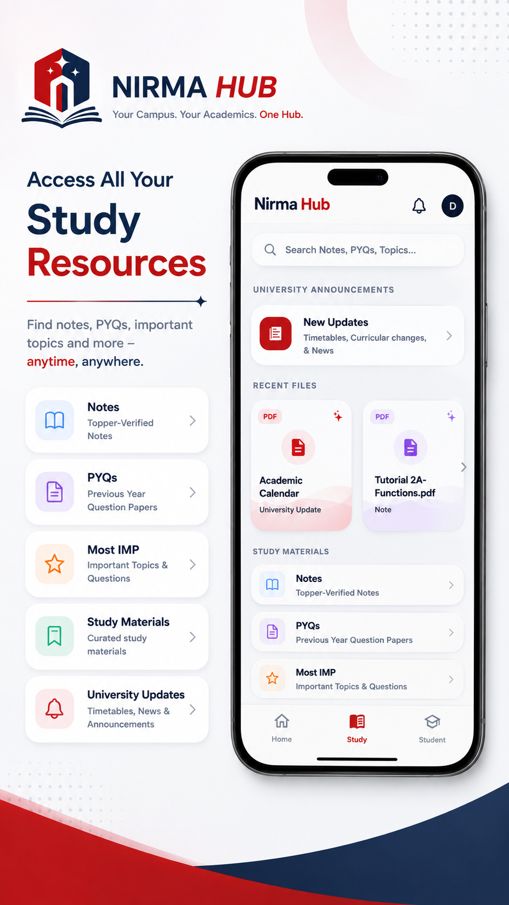
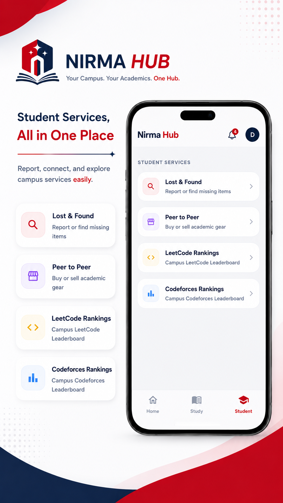

# Nirma Hub

A student-focused mobile application built for Nirma University students.

## Team

- **Dhyey Bhalani** — UI/UX, Frontend Development, Project Coordination, Marketing & Play Store Deployment
- **Harshil Dhameliya** — UI/UX, Frontend Development, Agile Project Execution, Content Management & Testing
- **Monil Mangukiya** — UI/UX, Academic Resources & Content Management, Structure Design & Testing
- **Dhruv Bhalala** — Backend Development, Database & Authentication

## Features

- **Study Resources** — Notes, PYQs, important topics and academic materials.
- **Timetable & Academic Calendar** — Daily classes, exams, holidays and academic events.
- **University Updates** — Important academic announcements and updates.
- **Student Services** — Lost & Found, Peer-to-Peer listings and coding leaderboards.
- **Academic Tools** — SGPA calculator, semester progress and student utilities.
- **Global Search** — Quickly find academic resources and content.

## Screenshots

  
  
  
  

## Tech Stack

- **Flutter & Dart** — Mobile application development
- **Supabase** — Backend services
- **PostgreSQL** — Database
- **Git & GitHub** — Version control and collaboration

## Project

Nirma Hub is a collaborative project developed by a four-member team to bring essential academic resources, student utilities and campus services together in one application.

## Download

The application will be available on Google Play Store very soon.

## Built For

**Nirma University Students**

---

Made with ❤️ by the Nirma Hub team.
